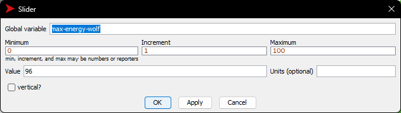

# Комп'ютерні системи імітаційного моделювання

## Лабораторна робота №2: Редагування імітаційних моделей у середовищі NetLogo

### Автор: Оцевик Владислав Андрійович, група СПм-23-4

<br>

## Опис роботи
### Варіант 7: Модель взаємодії "Хижак - Жертва" (Wolf Sheep Predation)

Модель розроблена в середовищі [NetLogo](http://www.netlogoweb.org/launch#http://www.netlogoweb.org/assets/modelslib/Sample%20Models/Biology/Wolf%20Sheep%20Predation.nlogo) для симуляції взаємодії між вовками та вівцями. Завдання полягало в зміні логіки руху вовків та овець, щоб моделювати більш реалістичні сценарії взаємодії.

## Основні модифікації

1. **Логіка руху вовків**
   - Вилучено "зграйність" вовків. Тепер перед своїм ходом вовки аналізують оточення для виявлення овець і обирають напрямок руху так, щоб уникнути інших вовків. Якщо вовки знаходяться на одній клітині, виживає лише один.
   - Код логіки руху вовків у процедурі `wolf-move`:
     ```NetLogo
     to wolf-move
       let nearby-sheep sheep in-radius 3  ; Пошук овець в радіусі 3 одиниць
       let nearby-wolves other wolves in-radius 3  ; Пошук вовків у радіусі 3 одиниць
       ...
     end
     ```
2. **Логіка руху овець**
   - Вівці випадково рухаються полем, але змінюють напрямок при виявленні вовків поруч, щоб уникнути контакту.
   - Код логіки руху овець у процедурі `sheep-move`:
     ```NetLogo
     to sheep-move
       let nearby-wolves wolves in-radius 1  ; Пошук вовків у радіусі 1 одиниці
       ...
     end
     ```

## Додаткові зміни

1. **Зміна початкового значення енергії вовків**
   - Випадкове значення енергії задається кожному вовку з інтервалу від 0 до `max-energy-wolf`.
   - Код у процедурі `setup`:
     ```NetLogo
     set energy max (list 0 (max-energy-wolf - random 2 * wolf-gain-from-food))
     ```
2. **Оптимізація моделі для різних режимів**
   - Максимальна кількість овець зменшена в залежності від режиму роботи (браузерний або десктопний):
     ```NetLogo
     ifelse netlogo-web? [ set max-sheep 5000 ] [ set max-sheep 10000 ]
     ```

## Обчислювальний експеримент
### Дослідження оптимального значення **max-wolf-energy**

Виконано експеримент для вивчення впливу значення параметра **max-wolf-energy** на стабільність моделі. Результати для різних значень `max-wolf-energy` наведені нижче:

- **max-wolf-energy = 10**: Вовки не змогли підтримувати свою популяцію і вимерли.
- **max-wolf-energy = 20**: Овці почали домінувати, оскільки вовки не встигали їх доганяти.
- **max-wolf-energy = 40**: Досягнута певна рівновага, але згодом овці все одно домінували.
- **max-wolf-energy = 60**: Вовки з'їли всі овці та померли від голоду.
- **max-wolf-energy = 90**: Схожий результат – вовки швидко з'їли овець і також загинули.

### Висновки
Параметр **max-wolf-energy** впливає на початкову динаміку моделі, проте результат залишається випадковим навіть із новою логікою руху вовків і овець.

## Скриншоти

- 
- 
- 
- 
- 
- 
- 
- 

## Налаштування параметрів


